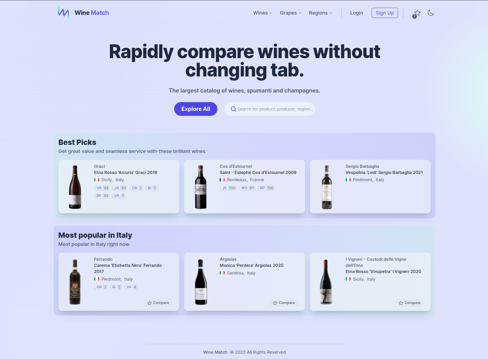

# Wine Match

The most extensive source of wines, spumanti and champagnes.




- **Framework**: [Next.js](https://nextjs.org/)
- **Database**: [Supabase](https://supabase.com)
- **Deployment**: [Vercel](https://vercel.com)
- **Search**: [Algolia](https://algolia.com)
- **State Management**: [Zustand](https://github.com/pmndrs/zustand)
- **Styling**: [Tailwind CSS](https://tailwindcss.com)
- **Primitives**: [Radix UI](https://https://www.radix-ui.com)
- **Icons**: [Heroicons](https://heroicons.com)
- **Fonts**: `@next/font`
- **Dark mode**: `next-themes`
- **Analytics**: [Vercel Analytics](https://vercel.com/analytics)

## Credits

A huge thanks for inspiration, code snippets and ideas to:

- Lee Robinson [@leeerob](https://twitter.com/leeerob)
- Shadcn [@shadcn](https://twitter.com/shadcn)
- Florentin Eckl [@ecklflorentin](https://twitter.com/ecklflorentin)
- Muhammad Afifudin [@afiiif](https://github.com/afiiif)

## Running Locally

```bash
git clone https://github.com/giacomogaglione/wine-match.git
cd wine-match
pnpm install
pnpm dev
```

Create `.env` file.

## License

Licensed under the [license](https://github.com/giacomogaglione/wine-match/blob/main/LICENSE.txt).
